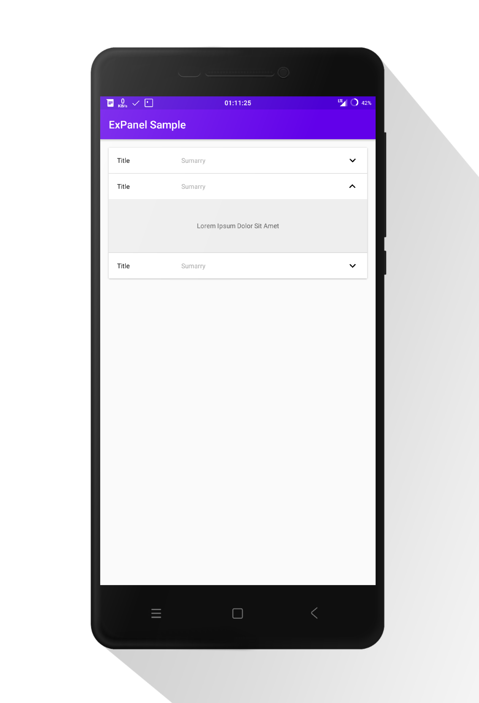
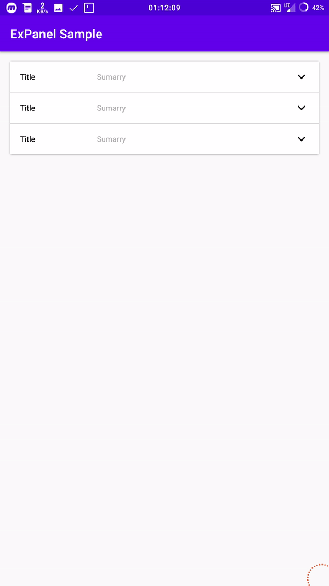

[](https://github.com/syaikhanagil/expanel/) &nbsp;&nbsp; [](https://jitpack.io/#syaikhanagil/expanel) &nbsp;&nbsp; [](https://opensource.org/licenses/Apache-2.0)
&nbsp;<br>
&nbsp;
## ExPanel
Material Design Expandable Panel Layout Library.
&nbsp;<br>
<div align="center">
&nbsp;&nbsp;
</div>
<br>
&nbsp;
<div align="center">

</div>
&nbsp;<br>

_______


## Import

```groovy
implementation 'net.syaikhanagil:expanel:1.0.0'
```
&nbsp;<br>
## Usage
```xml
<LinearLayout
	xmlns:android="http://schemas.android.com/apk/res/android"
	android:layout_height="wrap_content"
	android:layout_width="match_parent"
	android:orientation="vertical"
	xmlns:app="http://schemas.android.com/apk/res-auto">
	
	<!-- Header Container Start -->
	<net.syaikhanagil.expanel.ExPanelHeader
		android:layout_height="wrap_content"
		android:layout_width="match_parent"
		android:id="@+id/idHeader"
		app:expanel_Indicator="@id/idIndicator"
		app:expanel_layout="@id/idExPanel"
		app:expanel_toggleOnClick="true">

		<RelativeLayout
			android:background="#ffffff"
			android:layout_height="48dp"
			android:layout_width="match_parent"
			android:paddingLeft="16dp"
			android:paddingRight="16dp">

			<TextView
				android:layout_centerVertical="true"
				android:layout_height="wrap_content"
				android:layout_width="wrap_content"
				android:text="Title"
				android:textColor="#000000"/>

			<TextView
				android:layout_centerVertical="true"
				android:layout_height="wrap_content"
				android:layout_marginLeft="120dp"
				android:layout_width="wrap_content"
				android:text="Sumarry"
				android:textColor="#AAA"/>

			<android.support.v7.widget.AppCompatImageView
				android:adjustViewBounds="true"
				android:id="@+id/idIndicator"
				android:layout_alignParentRight="true"
				android:layout_centerVertical="true"
				android:layout_height="wrap_content"
				android:layout_marginLeft="16dp"
				android:layout_width="wrap_content"
				app:src="@drawable/ic_expanelheader_indicators"/>

		</RelativeLayout>

	</net.syaikhanagil.expanel.ExPanelHeader>
	<!-- Header Container End -->
	
	<!-- Content Container Start -->
	<net.syaikhanagil.expanel.ExPanel
		android:id="@+id/idExPanel"
		app:expanel_isExpand="false"
		android:layout_height="wrap_content"
		android:layout_width="match_parent">
		
		<!-- Your content here -->
		
	</net.syaikhanagil.expanel.ExPanel>
	<!-- Content Container End -->

</LinearLayout>

```
&nbsp;<br>
• You must connect ExpanelHeader and Layout with attribute `expanel_layout`, they must have the same parent
<br>• Define the indicator view with attribute `expanel_Indicator`
<br>• Modify the header indicator rotation use attribute `expanel_IndicatorRotationExpand` and `expanel_IndicatorRotationCollapsed`
<br>• To disable or enable the expanel you can use `.setEnable(true or false)`
<br>• Listener
```java
    ExPanel mExPanel = (ExPanel) findViewById(R.id.***);
	mExPanel.setExPanelListener(new ExPanel.ExListener()
	{
		@Override
		public void onExPanelChanged(ExPanel expanel, boolean isExpand)
		{
			// TODO: Implement this method
		}
	});
```
&nbsp;<br>
## Credits
Author : Syaikhan Agil &nbsp; [](https://syaikhanagil.net/)
<br>Follow me &nbsp;&nbsp;
<a href="https://facebook.com/syaikhanagil">
  
</a>&nbsp;&nbsp;&nbsp;<a href="https://github.com/syaikhanagil">
  
</a>&nbsp;&nbsp;&nbsp;<a href="https://twitter.com/syaikhanagil">
  
</a>
&nbsp;<br>
### License
```
   Copyright 2019 Syaikhan Agil

   Licensed under the Apache License, Version 2.0 (the "License");
   you may not use this file except in compliance with the License.
   You may obtain a copy of the License at

       http://www.apache.org/licenses/LICENSE-2.0

   Unless required by applicable law or agreed to in writing, software
   distributed under the License is distributed on an "AS IS" BASIS,
   WITHOUT WARRANTIES OR CONDITIONS OF ANY KIND, either express or implied.
   See the License for the specific language governing permissions and
   limitations under the License.

```

